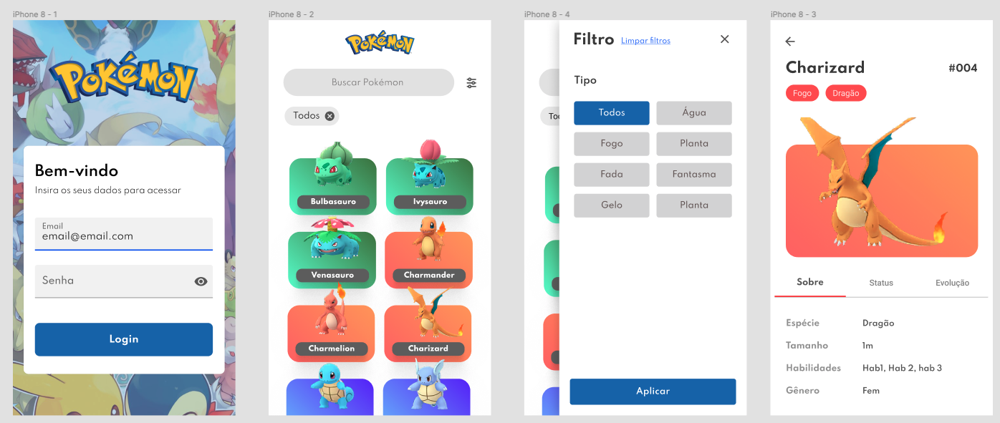

# Desafio Front End Mobile

O desafio tem como objetivo avaliar a pessoa candidata nas experiências: 
* Criação de layouts
* Padrões no uso do React Native
* Boas práticas de programação e organização de projeto

Vale lembrar que iremos avaliar tudo. 

Não deixe de fazer a tarefa, pois conhecimento técnico é um dos pilares da Mobix e sabemos que conhecimento se adquire com o tempo.

### Desafio

Criar um app que simula uma Pokedex.

* A API a ser utilizada se encontra neste link: https://pokeapi.co/docs/v2#pokemon-section
* Link para o Figma https://www.figma.com/file/943D2Dx1H3uEVBMast3hzt/Teste-Pokemon?node-id=0%3A1
* NÃO será permitido o uso de Expo ou relacionados.
* Realizar login, validando email e senha com algum back end (use o back end que você achar conveniente).
* Manter o usuário logado no app após o login.
* Scroll Infinito.
* Armazene os dados que você achar mais importante para execução do app.

## Requisitos

### Obrigatório
- Uso de framework de components: Ant Design ou Bootstrap ou React Native Paper ou UIKitten
- Styled-components ou Stylesheet
- Redux, Redux Saga ou React Query
- Redux-toolkit
- TypeScript
- Utilizar react navigation

### Opcionais:
- Uso de testes e2e usando `Detox`

### Como você deve nos enviar o desafio?
- É de caráter obrigatório o registro de horas para análise (você pode usar softwares como https://getharvest.com, https://clockify.me/, etc).
- Você deve enviar o desafio para `dev-team@mobixtec.com` com título `Processo Seletivo Mobix - Fase 2 - Desafio Técnico - SeuNome`.
- Gere uma versão online, de maneira que possamos abrir o aplicativo e não ter problemas de build.
- Detalhe toda a sua experiência, informando os pontos de desafio que você achou mais legal.